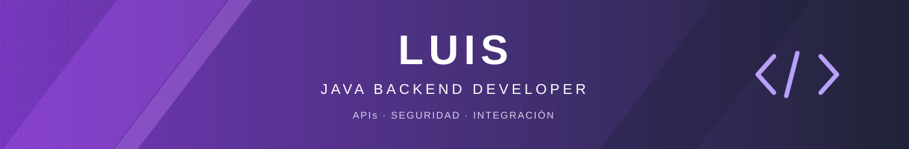

# Luis · Java Backend Developer

Construyo APIs e integraciones con foco en **concurrencia, seguridad, consistencia y observabilidad**. Este perfil reúne laboratorios independientes que permiten reproducir fallos y explicar decisiones de arquitectura con código y pruebas.

## Backend Systems Lab

Siete proyectos, siete conversaciones técnicas. Cada repositorio tiene un README, arquitectura Mermaid, decisiones documentadas, ejemplos curl, pruebas, Docker Compose y una consola Angular.

| Laboratorio | La pregunta que responde | Repositorio |
| --- | --- | --- |
| 01 · Resiliencia | ¿Cómo aceptar trabajo sin saturar el sistema? | [async-transaction-service](https://github.com/LuisDeveloper-Fer/async-transaction-service) |
| 02 · Consistencia | ¿Qué ocurre si un pago se confirma y su respuesta se pierde? | [payment-simulator](https://github.com/LuisDeveloper-Fer/payment-simulator) |
| 03 · Entrega | ¿Cómo notificar cuando el receptor está caído? | [webhook-delivery-hub](https://github.com/LuisDeveloper-Fer/webhook-delivery-hub) |
| 04 · Conciliación | ¿Cómo explicar diferencias entre dos reportes? | [reconciliation-engine](https://github.com/LuisDeveloper-Fer/reconciliation-engine) |
| 05 · Confianza | ¿Por qué un token válido no basta para acceder a un recurso? | [secure-api-demo](https://github.com/LuisDeveloper-Fer/secure-api-demo) |
| 06 · Observabilidad | ¿Qué proveedor está degradándose y cómo medirlo? | [transaction-monitor](https://github.com/LuisDeveloper-Fer/transaction-monitor) |

| 07 · Concurrencia | ¿Cómo coordinar muchas esperas sin saturar al proveedor? | [virtual-thread-orchestrator](https://github.com/LuisDeveloper-Fer/virtual-thread-orchestrator) |

## Demos públicas

- [Nexo · transacciones](https://luisdeveloper-fer.github.io/async-transaction-service/)
- [Mora · pagos](https://luisdeveloper-fer.github.io/payment-simulator/)
- [Trama · hilos virtuales](https://luisdeveloper-fer.github.io/virtual-thread-orchestrator/)

Demos interactivas alojadas en GitHub Pages: simulan estados en el navegador. Para ejecutar y medir el backend Java, cada repositorio incluye Docker Compose.

## Interfaces de los proyectos

| Nexo · transferencias | Mora · pagos |
| --- | --- |
|  |  |

| Enlace · notificaciones | Cuadra · conciliación |
| --- | --- |
|  |  |

| Umbral · acceso seguro | Pulso · monitoreo |
| --- | --- |
|  |  |

## Stack y áreas de interés

- **Backend:** Java 17/21, Spring Boot, REST, SOAP, WebClient, Maven e integración de sistemas.
- **Seguridad:** Spring Security, JWT, OAuth 2.0, TLS/mTLS y seguridad de APIs.
- **Datos y operación:** PostgreSQL, Oracle, Docker, Micrometer, Prometheus y Grafana.
- **Calidad:** pruebas unitarias e integración, contratos explícitos y decisiones justificadas.
- **Frontend de apoyo:** Angular para demostrar estados, experimentos y resultados.

## Cómo recorrer el portafolio

Empieza por **async-transaction-service**, continúa con **payment-simulator** y revisa sus guías de entrevista. Los badges de CI muestran el resultado del código actual; los documentos de validación explican el alcance probado.

Los proyectos usan datos ficticios y describen sus límites. No contienen código propietario ni afirman haber operado sistemas de producción.

---

**Enfoque profesional:** oportunidades como Backend Developer Java, APIs e integración de sistemas.
