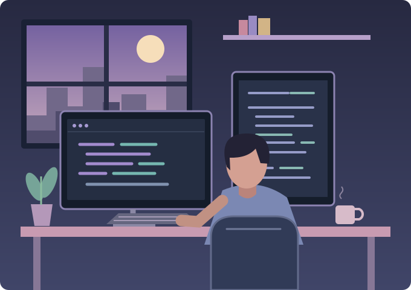

<h2 align="center">Hola, soy Luis 👋</h2>

<strong>Backend Developer Java</strong> APIs, integración de sistemas y código que se pueda entender y mantener.

 

### Sobre mí

☕ Mi stack principal es **Java 17/21 y Spring Boot**.

🔗 Mi enfoque está en las **APIs REST, los servicios SOAP y la integración de sistemas**.

🛡️ Me interesan la **seguridad de APIs, la concurrencia y la observabilidad**.

🧩 Busco soluciones claras y con decisiones técnicas que pueda explicar.

🎯 Busco oportunidades como **Backend Developer Java**.

### Tech stack

  
  
  
  
  

  
  
  
  
  

**Integración:** REST · SOAP · WebClient · procesamiento asíncrono

**Seguridad:** JWT · OAuth 2.0 · TLS / mTLS · OWASP

**Calidad:** pruebas unitarias e integración · métricas · manejo de errores

 

---

Entender el problema. Diseñar con criterio. Construir con cuidado.

