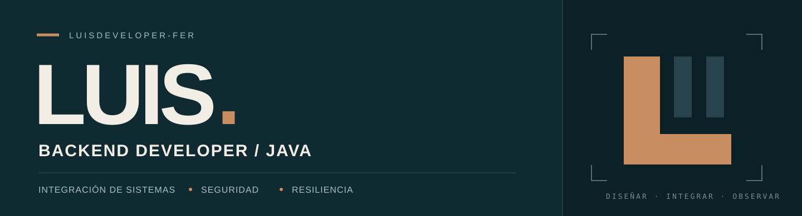

### Soy Luis. Desarrollo backend con Java.

Trabajo con **Java y el ecosistema Spring** para construir APIs e integrar sistemas. Me enfoco en la seguridad de las comunicaciones, el manejo de errores y el comportamiento de los servicios bajo carga.

Me importa que una solución se pueda **entender, probar y operar**: desde el contrato de una API hasta sus logs, métricas y decisiones de concurrencia.

**Busco oportunidades como Backend Developer Java.**

 

### Tecnologías principales

  
  
  
  
  
  

| Área | Stack y enfoque |
| :--- | :--- |
| **Backend** | Spring Boot · Spring Framework · Maven · JPA / Hibernate · programación asíncrona y concurrencia |
| **APIs e integración** | REST · SOAP / Web Services · XML / JSON · WebClient · microservicios · ISO 8583 · HTTP/HTTPS · TCP/IP |
| **Seguridad** | Spring Security · JWT · OAuth 2.0 · Basic Authentication · TLS 1.2/1.3 · mTLS · certificados, KeyStore y TrustStore · AES / AES-256-GCM · OWASP API Security |
| **Datos** | PostgreSQL · Oracle · SQL Server · SQL / PL-SQL · stored procedures · connection pooling |
| **Resiliencia y rendimiento** | Circuit breaker · rate limiting · timeouts y reintentos · análisis de TPS, latencia y concurrencia |
| **Observabilidad** | Micrometer · Prometheus · Grafana · monitoreo de aplicaciones · análisis de logs y troubleshooting |

### Herramientas y forma de trabajar

**Entornos y herramientas:** Linux / RHEL · Docker · Git / GitHub · JBoss EAP · Apache Tomcat · SonarQube · Postman · IntelliJ IDEA.

**Prácticas:** pruebas unitarias e integración · secure coding · code review · análisis de vulnerabilidades · Scrum / Agile.

**En operación:** troubleshooting de producción, alta disponibilidad y resiliencia.

**Frontend de apoyo:** Angular. **En exploración:** gRPC.

---

Contratos claros. Comunicaciones seguras. Sistemas observables.

